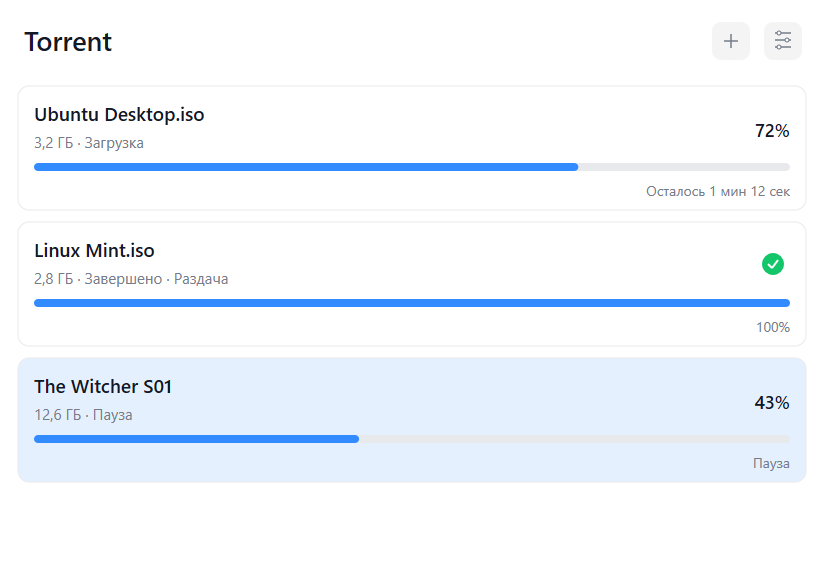
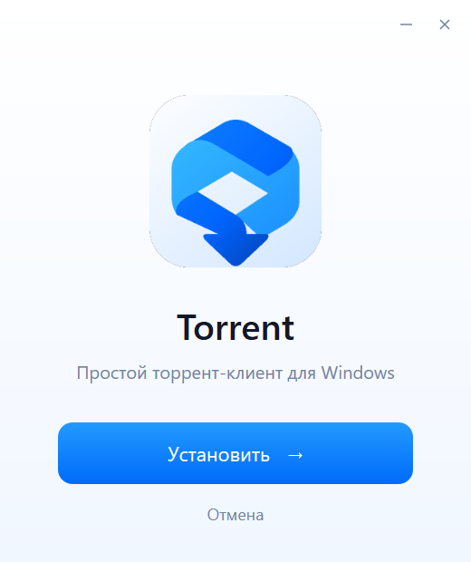
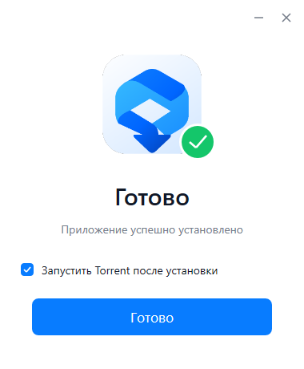

<p align="center">
  
</p>

<h1 align="center">Torrent</h1>

<p align="center">A lightweight, native BitTorrent client for Windows 11.</p>

<p align="center">
  <a href="https://github.com/sanderstripa/torrent/releases/tag/v0.1.4">Download v0.1.4</a>
  &nbsp;·&nbsp;
  <a href="https://github.com/sanderstripa/torrent/actions/workflows/windows.yml">Windows builds</a>
  &nbsp;·&nbsp;
  <a href="https://github.com/sanderstripa/torrent/issues">Report an issue</a>
</p>

<p align="center">
  <a href="https://github.com/sanderstripa/torrent/actions/workflows/windows.yml"></a>
  
  
  
</p>

Torrent keeps the interface focused on your downloads: a name, size, status, progress and remaining time. It uses C++20, Win32, Direct2D/DirectWrite and libtorrent, with no Electron, WebView, Qt or advertising.

## Download

**[Download the Windows installer](https://github.com/sanderstripa/torrent/releases/download/v0.1.4/Torrent-Setup.exe)**

Prefer to run the application without installing it? Download [Torrent-Windows-x64.zip](https://github.com/sanderstripa/torrent/releases/download/v0.1.4/Torrent-Windows-x64.zip), extract it and run `app/Torrent.exe`. Keep the included dependency licenses with the application. The ZIP version still stores settings and session data in your Windows user profile.

| v0.1.4 package | Size |
|---|---:|
| Installer | About 3.2 MB |
| Application, dependency licenses and uninstaller | About 9.7 MB |

The installer works for the current user without administrator privileges. It registers `.torrent` and magnet handlers with Windows. Select Torrent in Windows **Default apps** or **Open with** to make it your preferred handler.

Version **0.1.4 is the current release**. The installer currently uses Russian text; the client offers Russian and English in Settings.

## Interface

Version 0.1.4 uses an opaque matte-white palette, flat buttons, app-styled context menus and a compact 380 × 460 setup window (before display scaling). Typography uses Segoe UI Variable Text/Display when available, with Segoe UI as the fallback.

Settings apply and save immediately without Apply or Cancel buttons. The language and theme update the open settings window and the client. Incomplete folder input keeps the last valid absolute path. File selection retains its separate Apply/Cancel workflow.

Pending file selection no longer displays an empty selection as 100% complete. The ribbon icon now has a transparent background and transparent central opening, with no white tile or border. The symbol fills the available height across the application, installer and Windows icons. The torrent engine is unchanged. Settings remain writable after restarting the application.

Click a torrent once to select it. Press **Space** to pause or resume, or **Delete** to remove it from the list while keeping downloaded files. Double-click to open its files. The context menu remains available.



<p align="center">
  
  
</p>

[Selected torrent](docs/screenshots/selected-torrent.png) · [Settings after restart](docs/screenshots/settings-after-restart.png) · [File selection](docs/screenshots/files.png) · [Settings](docs/screenshots/settings.png) · [Live dark/English settings](docs/screenshots/settings-dark-live.png) · [Styled menu](docs/screenshots/menu-dark.png) · [Pending selection](docs/screenshots/pending-selection.png) · [Installation progress](docs/screenshots/setup-progress.png)

These images are captured from the compiled Windows UI with isolated sample data, rather than concept illustrations or live downloads.

## Features

- Open `.torrent` files and magnet links, or drag a `.torrent` file into the window.
- Pause, resume, stop and remove torrents.
- Change torrent priority by moving it up or down in the download queue.
- Select individual files and assign low, normal or high download priorities.
- Fetch magnet metadata before choosing which files to download.
- Restore downloads and file selections after restarting the application.
- Switch between light and dark themes, and Russian and English.
- Use four settings only: download folder, action on adding, theme and language.

No ads, Windows startup entry or notification system. There is one add button and no seed, peer or speed statistics in the main list.

## Using Torrent

Click **+** to open a torrent file or add a magnet link. Click a torrent card to open its file list. Check the files you want, select a row, choose a priority, click **Set**, then **Apply**.

Right-click a torrent card to pause, resume, stop, remove it from the list or change its queue position. Removing a torrent keeps its downloaded files. Stopping disables automatic management and stops transfers; resuming returns the torrent to the queue.

The default queue allows up to two active downloads and one active seeding torrent. The download-folder setting applies to newly added torrents.

Settings and session data are stored in `%LOCALAPPDATA%\Torrent`. Resume data is saved every 30 seconds, after relevant actions and during shutdown. Choosing files for a magnet link keeps its payload disabled until the selection is applied.

## Build from source

Requirements: Visual Studio 2022 with **Desktop development with C++** and the Windows SDK, CMake 3.24 or newer, Git, Python 3 and NSIS 3 for installer packaging.

```powershell
git clone https://github.com/sanderstripa/torrent.git
cd torrent
git clone --branch 2025.06.13 --depth 1 https://github.com/microsoft/vcpkg.git work/vcpkg
./work/vcpkg/bootstrap-vcpkg.bat -disableMetrics

cmake -S . -B build -A x64 `
  -DCMAKE_TOOLCHAIN_FILE="$PWD/work/vcpkg/scripts/buildsystems/vcpkg.cmake" `
  -DVCPKG_TARGET_TRIPLET=x64-windows-static `
  -DVCPKG_OVERLAY_TRIPLETS="$PWD/triplets" `
  -DCMAKE_MSVC_RUNTIME_LIBRARY=MultiThreaded

cmake --build build --config Release --parallel 2
ctest --test-dir build -C Release --output-on-failure
cmake --install build --config Release --prefix dist/app
python tools/validate_project.py
```

Dependencies are linked statically. The checked-in triplet builds Release dependencies only. The Windows workflow caches dependencies, runs the checks, enforces a 50 MiB application-payload budget and produces the installer and ZIP artifact.

To package the installer, copy the dependency `copyright` files from `build/vcpkg_installed/x64-windows-static/share` into `dist/app/licenses`, naming each file after its dependency. The workflow contains the complete packaging procedure. Then run:

```powershell
Push-Location installer
makensis /WX /INPUTCHARSET UTF8 Torrent.nsi
Pop-Location
cmake -S . -B build
cmake --build build --config Release --target TorrentSetup --parallel 2
Copy-Item build/Release/Torrent-Setup.exe dist/Torrent-Setup.exe
```

The installer installs to `%LOCALAPPDATA%\Programs\Torrent`. Its three screens are Install, progress without a destination path, and Done with an optional launch checkbox and one Done button. The native Direct2D setup shell contains an NSIS payload; installation and association registration remain in the NSIS backend. Progress reflects completed installation stages.

## Validation and current status

The [verified Windows build](https://github.com/sanderstripa/torrent/actions/runs/37817518949) passed compilation, linking, resource validation, torrent-engine integration tests, native-window creation, Direct2D rendering and clean shutdown.

Additional UI interaction checks change the folder, action, theme and language in the running application; validate incomplete paths; navigate and cancel custom menus; reopen settings to verify persistence; and capture the inactive settings frame and a real torrent awaiting file selection. These checks also passed locally in an isolated profile.

The engine tests transfer a known file over localhost using both `.torrent` and magnet, and check metadata retrieval, file priorities, payload selection, pause, stop, persistence and removal. The downloaded binary also passed a local Windows startup, rendering and shutdown check. Installer compilation and its three-screen flow were checked separately without modifying system associations.

For a local smoke check, run `Torrent.exe --smoke-test` from a writable folder. It uses a separate `smoke-data` folder, creates and renders the window, then exits without loading your normal session.

Current preview limitations:

- Installation and default-handler selection in a real user profile still need manual validation.
- Long-running transfers, internet-tracker compatibility and RAM/CPU usage under load have not yet been measured.

## Product icon

The product icon is included as [SVG](assets/icon.svg), [PNG](assets/icon-preview.png) and a [multi-resolution Windows ICO](assets/app.ico). The application and installer share the same icon.

## Issues

[Open an issue](https://github.com/sanderstripa/torrent/issues) with the application version, your Windows version and steps to reproduce the problem. Do not include private magnet links, downloaded content or personal paths unless they are necessary to reproduce the issue.

Torrent uses [libtorrent](https://www.libtorrent.org/). Dependency license notices are included with the Windows packages.
